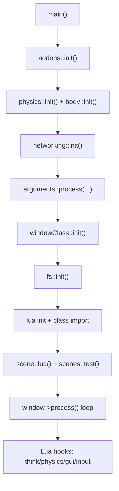

# T3 Engine

Lua-driven game engine core built on Raylib, Box2D, and pure chaos energy.

T3 Engine is a C++ game engine project with a scripting-first runtime.  
Core systems are bootstrapped in C++, then gameplay behavior is driven through Lua hooks, scene loading, and runtime objects.

Also i will be glad if you join my [Discord](https://discord.gg/tUZzEH5H9U)!

## Why It Is Cool

- Hook-based gameplay model (global hooks + per-object hooks).
- Lua-first runtime API (`T3`, `scene`, `physics`, `gui`, and more).
- Box2D physics with Lua collision callbacks.
- Render pipeline supporting sprites, brushes, models, and shaders.
- Scene loading path that combines XML scene data with Lua setup logic.
- Addon loading for modular logic packs.

## Architecture At A Glance



## Module Map

- `Render/` - renderables, sprites, textures, shaders, models, tiles.
- `Physics/` - world init, rigidbodies, collision callbacks, ray traces.
- `LUA/` - Lua state bootstrap, function bindings, class bridge, intervals.
- `Scene/` - scene and tileset loading, XML-driven map logic.
- `Input/` - keyboard, pointer, gamepad, mobile input handling.
- `GUI/` - GUI classes and manager integrations.
- `Networking/` - networking init and function stubs.
- `Addons/` - addon discovery and helper functions.

## Project Layout

```text
T3 Engine/
|- main.cpp
|- window.h
|- Arguments/
|- Addons/
|- GUI/
|- Input/
|- LUA/
|- Networking/
|- Physics/
|- Render/
|- Scene/
|- Sensors/
|- Errors/
|- Animations/
`- (third-party headers/sources: raygui, json, pugixml, etc.)
```

## Running The Engine

The runtime argument parser is defined in `Arguments/process.h`.

### Current CLI Options

- `--help` - print help information and exit.
- `--say=text` - print text to terminal and exit.
- `--lua=code` - execute Lua code and exit.
- `--skip-logo` - skip the logo sequence.
- `--scene=scenename` - force-load a scene.
- `--debug` - force debug mode.
- `--windowed` - run in windowed mode.
- `--w=width` - set window width.
- `--h=height` - set window height.

### Example Runs

```bash
./T3-engine --help
./T3-engine --scene=main --debug --windowed --w=1280 --h=720
./T3-engine --lua="print('hello from lua')"
```

## Build And Dependencies

This folder does not currently include a build manifest (`CMakeLists.txt`, `Makefile`, etc.), so exact compile/link commands are project-environment dependent.

### Dependencies Inferred From Source Includes

- `raylib` / `rlgl` / `raymath`
- `raygui`
- `box2d`
- `lua` (C API)
- `LuaBridge`
- `pugixml`
- `nlohmann/json`
- `cpp-httplib` (header present)
- `mapbox/earcut` (header present)

### Contributor TODOs For Build Reproducibility

- Add canonical Linux/Windows build commands.
- Document compiler standard and required flags.
- Pin dependency versions.
- Document expected output binary name/path.
- Add a one-command dev build entrypoint (for example via CMake or Make).

## Getting Started For Contributors

If you are new to this codebase, start here:

- `main.cpp` - startup order and subsystem bootstrap.
- `window.h` - runtime loop and hook dispatch.
- `LUA/Manager.h` - Lua lifecycle and class imports.
- `Scene/loader.h` - scene ingestion and object setup flow.
- `Render/renderable.h` - base runtime render object model.

Recommended first steps:

1. Run the binary with `--help`.
2. Run a specific scene with `--scene=...`.
3. Trace how hooks fire from input/physics/render ticks.
4. Inspect how Lua classes are imported and attached to runtime objects.

## Notes

- Runtime asset paths are expected by code (`assets/...`, `scenes/...`, `addons/...`).
- Keep docs aligned with behavior in `main.cpp` and `Arguments/process.h` as systems evolve.
